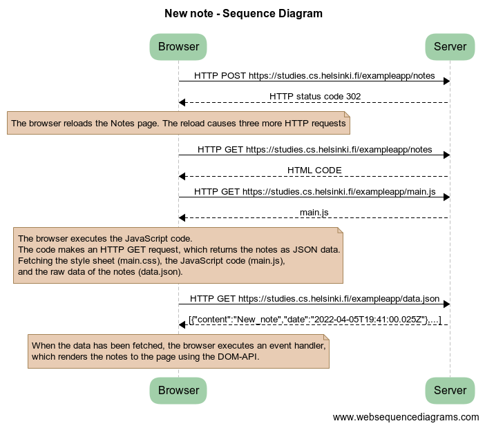
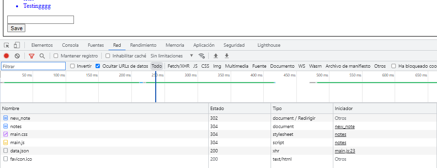
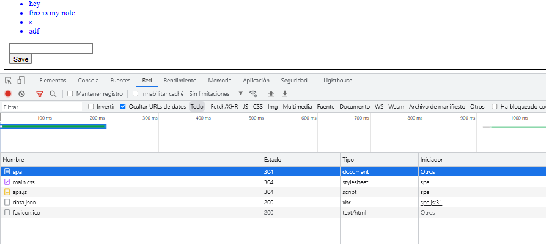
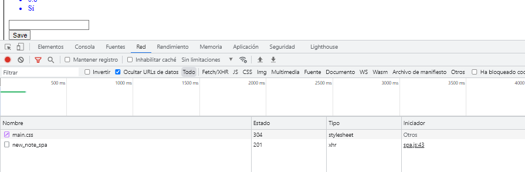

# Exercises 0.1.-0.6.

## 0.4: New note

### Create a similar diagram depicting the situation where the user creates a new note on page https://studies.cs.helsinki.fi/exampleapp/notes when writing something into the text field and clicking the submit button.

```
title New note - Squence Diagram
Browser->Server: HTTP POST https://studies.cs.helsinki.fi/exampleapp/notes
Server-->Browser:  HTTP status code 302

note over Browser: The browser reloads the Notes page. The reload causes three more HTTP requests

Browser->Server: HTTP GET https://studies.cs.helsinki.fi/exampleapp/notes
Server-->Browser: HTML CODE
Browser->Server: HTTP GET https://studies.cs.helsinki.fi/exampleapp/main.js
Server-->Browser: main.js 

note over Browser: 
The browser executes the JavaScript code. 
The code makes an HTTP GET request, which returns the notes as JSON data.
Fetching the style sheet (main.css), the JavaScript code (main.js), 
and the raw data of the notes (data.json).
end note over 

Browser->Server: HTTP GET https://studies.cs.helsinki.fi/exampleapp/data.json
Server-->Browser: [{"content":"New_note","date":"2022-04-05T19:41:00.025Z"},...]

note over Browser: 
When the data has been fetched, the browser executes an event handler, 
which renders the notes to the page using the DOM-API.
end note over 
```

 


## 0.5: Single page app
### Create a diagram depicting the situation where the user goes to the single page app version of the notes app at https://studies.cs.helsinki.fi/exampleapp/spa.

```
title Single Page App (SPA) - Sequence Diagram

Browser->Server: HTTP GET https://studies.cs.helsinki.fi/exampleapp/spa
Server-->Browser: HTML CODE

Browser->Server: HTTP GET https://studies.cs.helsinki.fi/exampleapp/spa.js
Server-->Browser: spa.js 

note over Browser: 
The browser executes the JavaScript code. 
The code makes an HTTP GET request, which returns the notes as JSON data and
adds HTML elements for displaying the notes to the page using the DOM-API.
end note over 

Browser->Server: HTTP GET https://studies.cs.helsinki.fi/exampleapp/data.json
Server-->Browser: [{"content":"bbb","date":"2022-04-06T08:02:20.772Z"},,...]

Browser->Server: HTTP GET https://studies.cs.helsinki.fi/favicon.ico
Server-->Browser:  favincon.ico
```
_SequenceDiagram.png) 



## 0.6: New note
### Create a diagram depicting the situation where the user creates a new note using the single page version of the app.
```
title New note - Sequence Diagram (SPA)

Browser->Server: HTTP GET https://studies.cs.helsinki.fi/exampleapp/main.css
Server-->Browser: main.css

note over Browser: 
The browser sends the newly created note
The code makes an HTTP POST request, which returns the note as JSON data.
end note over 

Browser->Server: HTTP POST https://studies.cs.helsinki.fi/exampleapp/new_note_spa
Server-->Browser: {"message":"note created"}

note over Browser: 
When the data has been sent, the browser executes an event, 
which renders the note to the page.
end note over

Server-->Browser: {content: "testing", date: "2022-04-06T14:45:27.542Z"}
```
.png) 
